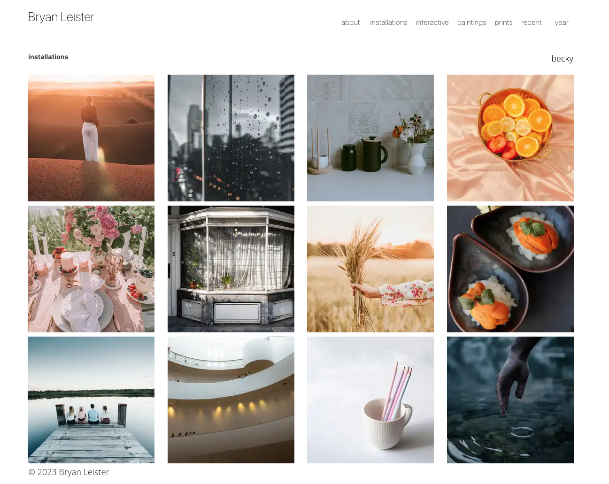

# A Gatsby Image Portfolio

A portfolio site built with [Gatsby](https://www.gatsbyjs.com/), based off of [gatsby-image-gallery](https://github.com/browniebroke/gatsby-image-gallery) by [@browniebroke](https://github.com/browniebroke). I also have added EXIF data using [@thomasgassmann](https://github.com/thomasgassmann)'s excellent [gatsby-plugin-sharp-exif](https://github.com/thomasgassmann/gatsby-plugin-sharp-exif) plugin.

## Project Goals

A headless server website that is fast, responsive and easy to maintain for a large database of images. Gatsby automatically generates multiple resolutions of the image files, allowing for fast loading on any device. The site concept is to use the image filenames for date sorting and additional data will be contained within the image's EXIF data, such as author, media, keywords, and more.

This is not designed to be a blog site with frequent text updates. The single goal for this implementation is to display a large quantity of images in a minimalist gallery-like format. Updates will simply be adding properly named new images in the appropriate folders. Simple text updates can be easily done by editing a pages code. One could easily add Gatsby blog-like functionality to the site, but it's left out in this version to keep it simple and easy to maintain.

## How it works

Many Gatsby sites use .md files to get information about a post, like a blog. If you only have a few images you could also make a .md file for every image and include tags and other information like the artist name, date, etc. Since my site will have hundreds of images, I don't want to create a corresponding text file for each image. Especially when you consider that a properly prepared image file can include all kinds of information in it's metadate, which is accessible as EXIF data. 

I also am taking advantage of the filename for easy sorting by date and accessing the title of the image. For longevity and cataloging purposes, this will insure that the date and title always are obvious and permanent, making it easy to locate and sort my images on my local computer. Any extra data like author, size, location will all be encoded in the photo's EXIF data and fetched as needed. 

When naming the images the date must always be first and in this format:  2020-03-21-  That makes the date the first 10 characters which will be removed via a regex function. The remaining characters are the title of the image, with a dash being converted to a space. So the filename '2020-03-21-My-First-Image.jpg' will be sorted and organized by it's date - the stripped title becomes "My First Image" on the photo caption.

To create a 'tag' like function, I use individual pages that are filtered in a few different ways:
- By folder where the image is located, i.e. 'paintings'
- By date contained in the filename, regardless what folder it was in
- By keyword contained in the EXIF data, in this example all images in the 'installations' folder are filtered by the author field in the EXIF data

The downside to this technique is that unlike .md  files, we can't pass a variable in the URL (as far as I can tell) which would allow for one template search block of code to be re-used. Instead, I have to create a new page for sorting and organizing. In other words, clicking on 'recent' or a year acts like a 'tag' would in a Gatsby blog post, but in reality it's loading a page that is hardcoded with the appropriate filter. This means a lot of duplicate code and a few more pages, but I think it outweighs the alternative of making a .md file for every image. From my research the reason pages in Gatsby are not allowed to pass variables via URL is a security risk, so this implementation is probably safer.

## Installation Instructions

- Step 1: Setup a [Gatsby](https://www.gatsbyjs.com/) site on your local development machine. Use a simple template, this will include instructions for installing Node.js and all the dependencies.
= Step 2: Use a good text editor like Atom (just found out it's now deprecated, so something similar like Sublime) to organize and edit your text files.
- Step 3: Download or clone this repository
- Step 4: Using Terminal (OSX) or other command-line interface navigate to the 'gatsby-portfolio' on your hard drive - 'cd /Users/bryan/Documents/GitHub/gatsby-portfolio'
- Step 5: In Terminal, run the command 'npm install'
- Step 6: Once all the packages are installed, run the command 'gatsby develop' and verify that it working in your browser

## How To Use With Your Own Images

- Step 1: Gather together all of your high-resolution scans and photos of your artwork
- Step 2: Name your images using this format (!IMPORTANT) '1995-02-17-Title-of-my-Artwork.jpg' replacing 'Title-of-my-Artwork' with your title and using '-' for spaces. Don't use any funny characters like /,$,%,.,;, and make sure only one '.' is used prior to a three letter extensioin of .jpg, .png or .psd. GIF images are probably OK, but will not be re-sized by Gatsby, so stick to .jpg , .png or .psd at this stage.
- Step 3: Export or convert your high-res images to something reasonable in size, like 2000 pixels on the longest dimension or less. As part of the export process, decrease the quality from maximum (no compression) to high and make sure the resulting files are in RGB format as .jpg or .png
- Step 4: Decide on your main media categories and create a folder named for each, as I have done. Drag your web-ready images into those folders
-- All media/subject pages are based on the folder name, i.e. 'interactive' work resides in the 'images/interactive' folder. The interactive.tsx page includes a Gatsby query to fetch those images and build the gallery
- Step 5: Review how I organized the 'year' folder with a file named '1990.tsx' for each year. Add or delete files with a year that you have not created work. The app builds the 'year' menu based on what's in this folder and then finds all the images that start with that year in their filename. If you keep the pages I have included but have no work for that year, the page will be empty. Otherwise, the page builds a gallery from all work created in that year.
- Step 6: Edit the 'gatsby-config.js' with your information as well as pages like the 'about' page.
- Step 7: After you've organized your site, test it out using 'gatsby develop' in the Terminal and adjust to your needs!

## Other Details

I have a category 'installations' that includes all images from an installation project. But, I'd like to also have a gallery page devoted to a specific installation. To do that, I've created a directory called 'installations' and a page file to select and load only images from that specific installation. That way, I can add a description of the project, and also all of the images. In this test example, I've called the installation 'becky' and filtered based on the EXIF field Artist. That way, it finds all the images in the 'images/installations' folder and also only images where the Artist is Becky.

The hack I'm using so the URL is pretty is to create a directory in Pages called 'installations' outside of the 'work' directory. If I put that sub-directory into the 'work' folder, it shows up in the auto-generated menu and I'd rather just hard-code it into the installations.tsx file.

